 

> Computer Science major at Mehran University of Engineering & Technology, Hyderabad, Sindh. 
> Full-stack developer, currently deep in agentic AI.

<!-- I'm usually the one holding the messy middle together — coordinating between product, QA and dev so the release actually ships on time. At [Verior](https://www.linkedin.com/company/81822374/) that went from a QA internship to Execution Lead inside three months; from there it was release trains, sprint velocity, and turning "it's flaky" into a repeatable pipeline. -->

<!-- `assets/profile.jpg` isn't in this build yet, so `ascii.svg` above is a placeholder silhouette, and the GitHub Stats rows show "—" until the Actions workflow runs once. See <b>about this readme</b> below to switch both on. -->

