 

> Computer Science major at Mehran University of Engineering & Technology, Hyderabad, Sindh. 
> Full-stack developer, currently deep in agentic AI.

<table>
<tr>
<td width="50%">

### [mojo-OS](https://github.com/moiz-codez/mojo-OS)
Windows-like desktop environment that runs entirely in the browser — React, Next.js, Tailwind.

</td>
<td width="50%">

### [lappu-lang](https://github.com/moiz-codez/lappu-lang)
A custom programming language built for a Compiler Construction course.

</td>
</tr>
<tr>
<td width="50%">

### [huffman-compression](https://github.com/moiz-codez/huffman-compression)
Huffman compression in x86-64 assembly — encode and decode from the metal up.

</td>
<td width="50%">

### [hospital-patient-record-management-system](https://github.com/moiz-codez/hospital-patient-record-management-system)
Hospital patient records system built with C# Windows Forms and SQLite.

</td>
</tr>
<tr>
<td width="50%">

### [guide-grad](https://github.com/moiz-codez/guide-grad)
Helping Pakistani students navigate higher ed — universities, scholarships, ambassador connections.

</td>
<td width="50%">

### [glidemate-ogn](https://github.com/moiz-codez/glidemate-ogn)
Flask service streaming live glider positions from the Open Glider Network APRS feed.

</td>
</tr>
<tr>
<td width="50%">

### [2D-modular-game-engine](https://github.com/moiz-codez/2D-modular-game-engine)
A flexible, modular 2D game engine built in Java.

</td>
<td width="50%">

### [she_secure](https://github.com/moiz-codez/she_secure)
A women's safety app built with Flutter.

</td>
</tr>
</table>

## ❤️ A Note of Thanks & Inspiration

One of the things I love most about the open-source community is that knowledge, creativity, and inspiration are meant to be shared.

This README didn't come together out of nowhere. While exploring GitHub, I came across several incredible developer profiles that genuinely inspired me. Seeing their creativity motivated me to experiment, learn new techniques, and challenge myself to build a profile that reflects who I am.

I didn't want to simply copy their work—I wanted to understand what made their designs so great, take inspiration from them, and reimagine those ideas in my own way. Every section has been customized, redesigned, and adapted to match my personality and style, but the original spark came from these amazing developers.

They've unknowingly helped me learn more about GitHub profile design, Markdown, SVG animations, Github Workflow and creative presentation. This README exists because of the open-source mindset they embraced by sharing their work with the community.

### 🌟 Thank You

- **[tayyabadev](https://github.com/tayyabadev)**  
  Inspired the **"HI, I'M MOIZ"** hero section that welcomes visitors to my profile.

- **[andriidrok1](https://github.com/andriidrok1)**  
  Inspired the animated **ASCII profile artwork**, which encouraged me to experiment with terminal-style visuals.

- **[Andrew6rant](https://github.com/Andrew6rant)**  
  Inspired the **Neofetch-inspired developer card**, one of my favorite sections of this README.

- **[Sharann-del](https://github.com/Sharann-del)**  
  Inspired the **timeline** and **developer ecosystem** sections that help tell my journey in a more engaging way.

## 🌍 Standing on the Shoulders of Giants

Every developer starts by learning from others.

This profile is another example of that beautiful cycle. I learned from these talented creators, built upon their ideas, and transformed them into something that feels uniquely mine. I hope that, one day, someone discovers my profile, finds inspiration in it, and creates something even better.

That's what makes open source and the developer community so special—we don't just write code; we inspire one another to keep learning, improving, and building.

To everyone mentioned above: **thank you** for sharing your creativity with the world. Your work inspired another developer, and I'm genuinely grateful for it.

If you're visiting my profile, I highly encourage you to check out their GitHub profiles—they're all incredibly talented and absolutely worth following.

Happy coding! ❤️🚀